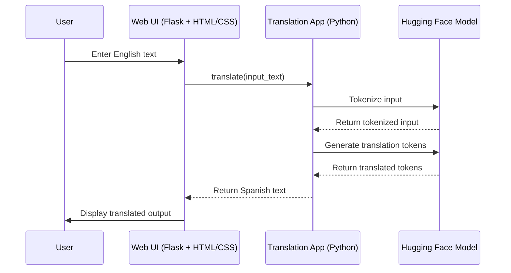

# Translatica: English to Spanish Translation

**Translatica** is a production-ready AI-powered **English → Spanish literary translation system** designed to preserve tone, context, and narrative style. It leverages a **LoRA-fine-tuned transformer (PEFT)** to deliver high-quality translations with low inference cost, supported by a modular NLP pipeline, BLEU-based evaluation, and a clean full-stack web interface.

The system is **Dockerized and deployment-ready**, and can be scaled as a **SaaS product** for publishers and content platforms—demonstrating strong expertise in **model optimization, end-to-end system design, and business-oriented AI engineering**.


[](https://github.com/user-attachments/assets/4fcf331c-31d4-4ff6-b71b-41077c4dfe46)

---

##  Live Demo
Try the real-time English → Spanish Translator here:  
[**Translatica– Click Here**](https://bilingual-bridge.onrender.com/)

---

## Project File Structure
```
Bilingual-Bridge/
│
├── .github/
│   └── workflows/
│       └── main.yml
│
├── fine-tuned-model/
│   ├── adapter_config.json
│   ├── adapter_model.safetensors
│   └── README.md
│
├── fine-tuned-tokenizer/
│   ├── source.spm
│   ├── special_tokens_map.json
│   ├── target.spm
│   ├── tokenizer_config.json
│   └── vocab.json
│
├── logs/
│
├── notebook/
│   └── Experiment.ipynb
│
├── src/
│   ├── data.py
│   ├── logger.py
│   └── model.py
│
├── static/
│   ├── css/
│   │   └── style.css
│   └── js/
│       └── script.js
│
├── templates/
│   └── index.html
│
├── tests/
│
├── .gitignore
├── app.png
├── demo.mp4
├── Dockerfile
├── LICENSE
├── README.md
├── requirements.txt
├── setup.py
└── train.py
```

---

## Technical Stack

| Feature                        | Description                                                                 |
| ------------------------------ | --------------------------------------------------------------------------- |
| **Translation**   | Translate fluently English to Spanish                                 |
| **Model**          | [Helsinki-NLP/opus-mt-en-es](https://huggingface.co/Helsinki-NLP/opus-mt-en-es) (LoRA fine-tuned)         |
| **Fine-Tuned LLM**          | Custom model fine-tuned using **LoRA + PEFT** on bilingual datasets         |
| **Techniques Used**         | Peft, LoRA (Parameter Efficient Fine-Tuning), SentencePiece Tokenizer        |
| **Frontend**               | Responsive UI built with **HTML + CSS + JS**, integrated via Flask          |
| **Backend API**             | Lightweight Flask server with endpoint for dynamic translation              |
| **Tokenizer Customization** | Trained custom tokenizers with SentencePiece for improved language fidelity |
| **Offline-Ready**           | Entire model is local & GPU-optional — designed for CPU-based deployment    |
| **Modular Codebase**        | Fully modular design following clean code & MLOps practices                 |
| **Tested Dataset**          | Trained and validated on Bangla-Spanish aligned translation corpus          |
| **Evaluation**     | BLEU Score via `evaluate`       |
| **CI/CD Pipeline**   | GitHub Actions (Model Training/Evaluation Workflow)                                |
| **Containerization** | Docker                                                  |
| **Hosting Services** | Render   |

---

## Model Training

* **Dataset:** [`opus_books`](https://huggingface.co/datasets/Helsinki-NLP/opus_books)

  * English-Spanish parallel corpus
  * High-quality literary translation data

* **Base Model:** [`Helsinki-NLP/opus-mt-en-es`](https://huggingface.co/Helsinki-NLP/opus-mt-en-es)

  * Pretrained NMT model for English → Spanish

* **Tokenizer:**

  * SentencePiece tokenizer (`AutoTokenizer`) from the base model

* **Fine-Tuning Strategy:**

  * **PEFT (Parameter-Efficient Fine-Tuning)** using **LoRA (Low-Rank Adaptation)**
  * **Frozen base model** — only LoRA-injected layers are trainable

* **LoRA Configuration:**

  * `r = 8`, `alpha = 32`, `dropout = 0.1`
  * Target Modules: `["q_proj", "v_proj"]` (attention heads)

* **Trainer Configuration:**

  * Epochs: `3`
  * Batch Size: `16`
  * Learning Rate: `2e-5`
  * Weight Decay: `0.01`
  * Evaluation: Per Epoch
  * Early Stopping: Enabled
  * Mixed Precision: Enabled (`fp16`)

* **Evaluation Metric:**

  * BLEU Score using Hugging Face `evaluate` library

* **Training Performance:**

| Epoch | Training Loss | Validation Loss | BLEU Score |
| ----- | ------------- | --------------- | ---------- |
| 1     | 1.3853        | 1.3317          | 0.1164     |
| 2     | 1.3521        | 1.2777          | 0.1136     |
| 3     | 1.3885        | 1.2645          | 0.1128     |

* **Saving Checkpoints:**

  * Tokenizer: `tokenizer.save_pretrained("saved_tokenizer")`
  * LoRA Adapter: `peft_model.save_pretrained("saved_peft_model")`

* **Trainable Parameters:**

  * Only \~0.38% of parameters were updated
  * Verified using: `peft_model.print_trainable_parameters()`

---

##  Model Performance

| Epoch | Training Loss | Validation Loss | BLEU Score |
|-------|---------------|-----------------|------------|
| 1     | 1.3853        | 1.3317          | 0.1164     |
| 2     | 1.3521        | 1.2777          | 0.1136     |
| 3     | 1.3885        | 1.2645          | 0.1128     |

**Observations**:
- Training and validation loss gradually decreased.
- BLEU score stabilized over epochs, indicating early convergence.
- Indicates the model is learning but BLEU can be improved further with more epochs or tuning.

---

## System Architecture 


---

##  Docker Support
```Dockerfile
FROM python:3.10
WORKDIR /app
COPY . .
RUN pip install -r requirements.txt
CMD ["python", "app.py"]
```

Build & run:
```bash
docker build -t translatica .
docker run -p 8501:8501 translatica
```

---

## Future Enhancements
- Add multilingual support (more language pairs)
- Quantize and optimize for edge devices

---

## How to Run (Locally)
```bash
git clone https://github.com/Md-Emon-Hasan/Translatica
cd translatica
pip install -r requirements.txt
streamlit run app.py
```
---

## Prepared by  

**Md Emon Hasan**  
**Email:** iconicemon01@gmail.com  
**WhatsApp:** [+8801834363533](https://wa.me/8801834363533)  
**GitHub:** [Md-Emon-Hasan](https://github.com/Md-Emon-Hasan)  
**LinkedIn:** [Md Emon Hasan](https://www.linkedin.com/in/md-emon-hasan-695483237/)  
**Facebook:** [Md Emon Hasan](https://www.facebook.com/mdemon.hasan2001/)

---
