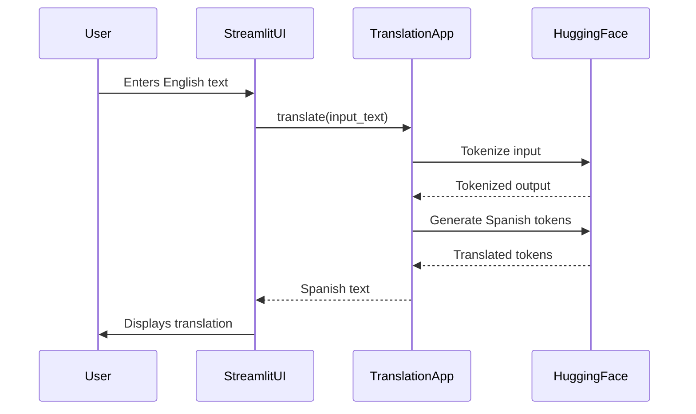

# Bilingual Bridge: English to Spanish Translation
[](https://github.com/user-attachments/assets/55599f0a-0a62-4bee-9406-b79212dd3890)
## 📌 Overview
Build a Machine Translation System capable of translating English text into Spanish using a fine-tuned Transformer-based model. The goal is to adapt a pre-trained multilingual model (Helsinki-NLP/opus-mt-en-es) on a domain-specific parallel corpus to improve translation. Deployed with a responsive Streamlit UI, containerized with Docker, and integrated with GitHub CI/CD for continuous delivery.

---

## 🚀 Live Demo

🎯 Try the real-time English → Spanish Translator here:  
👉 [**Bilingual Bridge – Click Here**](https://bilingual-bridge.onrender.com/)

---

## ✅ Real-World Use Case

In today's globalized digital ecosystem, cross-lingual communication is a key challenge. A **customized English-to-Spanish translation model** is highly valuable for:

  * 🌐 **Global E-Commerce Platforms** where product descriptions, reviews, and customer support need real-time translation.
  * 📚 **E-learning and EdTech** where English content (like books, tutorials) needs translation into native languages to expand reach.
  * 🏥 **Healthcare Applications** to translate medical information for Spanish-speaking communities.
  * 📱 **Chatbots and Virtual Assistants** that operate in multilingual regions.
  * 📰 **News and Media Localization** where news articles in English are auto-translated for Spanish audiences.

---

## 📘 Technical Stack
| **Category**         | **Technology/Resource**                                                                 |
|----------------------|---------------------------------------------------------------------------------------|
| **Programming Language** | Python 3.9+                                                                         |
| **Core ML Framework** | HuggingFace Transformers 4.28+                                                      |
| **Model Architecture** | MarianMT (Transformer-based Seq2Seq)                                               |
| **Pretrained Model** | Helsinki-NLP/opus-mt-en-es                                                          |
| **Dataset**          | OPUS Books (en-es) + Custom Spanish Parallel Corpus                                 |
| **Data Processing**  | HuggingFace Datasets, Pandas, NLTK (Text Preprocessing)                            |
| **Tokenization**     | SentencePiece (via HuggingFace Tokenizers)                                          |                                                    
| **CI/CD Pipeline**   | GitHub Actions (Model Training/Evaluation Workflow)                                |
| **Containerization** | Docker (with PyTorch Base Image)                                                   |
| **Web UI**          | Streamlit UI                            |
| **Hosting Services** | Render   |

---

## 🧠 Model Training
- **Dataset:** `opus_books` (English-Spanish parallel corpus)
- **Model:** `Helsinki-NLP/opus-mt-en-es`
- **Tokenizer:** SentencePiece tokenizer from pretrained model
- **Fine-tuning:**
  - Batch size: 16
  - Epochs: 3
  - Learning rate: 2e-5
  - Weight decay: 0.01
  - Early stopping used
- **Saving:** Trained model and tokenizer saved for deployment

---

## 🧱 Modular Codebase
```
Bilingual-Bridge/
│
├── .github/                           # GitHub specific files
│   └── workflows/
│       └── main.yml                   # GitHub Actions CI/CD workflow file
│
├── fine-tuned-model/                          
│   └── fine-tuned-model/
│   └── fine-tuned-tokenizer/      
│
├── tests/
│   └── data.py
│
├── src/                     
│   └── data.py
│   └── logger.py
│   └── model.py
│
├── app.py
├── train.py
├── setup.py
├── logs/                   # Training and app logs
├── app.png                 # Utility functions
├── LICENSE  
├── Dockerfile              # For containerization
├── requirements.txt        # Dependencies
└── README.md               # Project summary
```

---

## 📱 System Architecture 


---

## 🐳 Docker Support
```Dockerfile
FROM python:3.10
WORKDIR /app
COPY . .
RUN pip install -r requirements.txt
CMD ["streamlit", "run", "app.py", "--server.port=8501", "--server.address=0.0.0.0"]
```

Build & run:
```bash
docker build -t bilingual-bridge .
docker run -p 8501:8501 bilingual-bridge
```

---

## 🖥️ Web App
Features:
- Input box for English text
- Button-triggered translation
- Spanish output display
- Logs activity in real-time

Example:
```python
translated_tokens = model.generate(
    inputs['input_ids'],
    max_length=256,
    num_beams=8,
    early_stopping=False
)
```

---

## 🔮 Future Enhancements
- Add multilingual support (more language pairs)
- Quantize and optimize for edge devices

---

## 📂 How to Run (Locally)
```bash
git clone https://github.com/Md-Emon-Hasan/Bilingual-Bridge
cd bilingual-bridge
pip install -r requirements.txt
streamlit run app.py
```
---

## ✍️ Prepared by  

**Md Emon Hasan**  
📧 **Email:** iconicemon01@gmail.com  
💬 **WhatsApp:** [+8801834363533](https://wa.me/8801834363533)  
🔗 **GitHub:** [Md-Emon-Hasan](https://github.com/Md-Emon-Hasan)  
🔗 **LinkedIn:** [Md Emon Hasan](https://www.linkedin.com/in/md-emon-hasan-695483237/)  
🔗 **Facebook:** [Md Emon Hasan](https://www.facebook.com/mdemon.hasan2001/)

---
