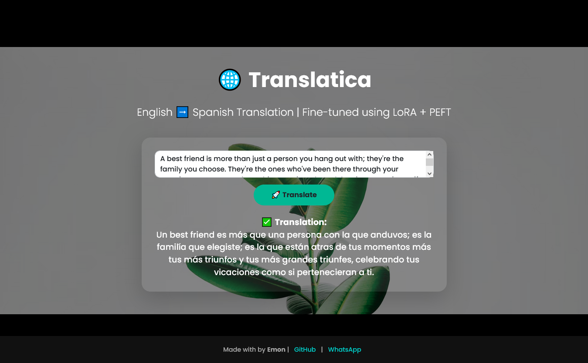

# Translatica: English to Spanish Translation

**Translatica** is a production-ready AI-powered **English → Spanish literary translation system** using a **LoRA-fine-tuned transformer (PEFT)**. Built with a monolithic architecture featuring separate training and inference modules.

[](https://github.com/Md-Emon-Hasan/Translatica/actions)
[](https://python.org)
[](https://fastapi.tiangolo.com)



---

## Live Demo

[**Try Translatica Live**](https://bilingual-bridge.onrender.com/)

---

## Project Structure (Monolithic Architecture)

```
Translatica/
│
├── app/                                 # FASTAPI INFERENCE MODULE
│   ├── __init__.py                      # Package initializer
│   ├── main.py                          # FastAPI application entry point
│   │
│   ├── api/                             # API Layer
│   │   ├── __init__.py                  # Package initializer
│   │   └── routes.py                    # API endpoints (/translate, /health)
│   │
│   ├── core/                            # Core Configuration
│   │   ├── __init__.py                  # Package initializer
│   │   ├── config.py                    # Pydantic settings & environment config
│   │   └── model.py                     # Model manager (load, inference, cleanup)
│   │
│   ├── services/                        # Business Logic
│   │   ├── __init__.py                  # Package initializer
│   │   └── translation.py               # Translation service (text preprocessing)
│   │
│   └── utils/                           # Utilities
│       ├── __init__.py                  # Package initializer
│       └── logger.py                    # Application logger configuration
│
├── training/                            # MODEL TRAINING MODULE
│   ├── __init__.py                      # Package initializer
│   ├── data.py                          # Dataset loading & preprocessing (opus_books)
│   ├── model.py                         # LoRA configuration & PEFT model setup
│   ├── trainer.py                       # HuggingFace Trainer arguments & setup
│   ├── logger.py                        # Training logger configuration
│   ├── train.py                         # Main training script with CLI
│   └── run_train.py                     # Alternative training runner
│
├── tests/                               # TEST SUITE (63 tests, 92% coverage)
│   ├── __init__.py                      # Package initializer
│   ├── conftest.py                      # Pytest fixtures & test configuration
│   ├── test_api.py                      # API endpoint tests
│   ├── test_config.py                   # Configuration tests
│   ├── test_model.py                    # Model manager tests
│   ├── test_services.py                 # Translation service tests
│   ├── test_training_data.py            # Training data module tests
│   ├── test_training_model.py           # Training model module tests
│   ├── test_training_trainer.py         # Trainer module tests
│   ├── test_training_logger.py          # Training logger tests
│   └── test_training_train.py           # Main training script tests
│
├── fine-tuned-model/                    # TRAINED MODEL ARTIFACTS
│   │
│   ├── fine-tuned-model/                # LoRA Adapter Weights
│   │   ├── README.md                    # Model card & documentation
│   │   ├── adapter_config.json          # LoRA adapter configuration
│   │   └── adapter_model.safetensors    # LoRA adapter weights
│   │
│   └── fine-tuned-tokenizer/            # Tokenizer Files
│       ├── source.spm                   # Source language SentencePiece model
│       ├── target.spm                   # Target language SentencePiece model
│       ├── vocab.json                   # Vocabulary mapping
│       ├── tokenizer_config.json        # Tokenizer configuration
│       └── special_tokens_map.json      # Special tokens mapping
│
├── static/                              # FRONTEND ASSETS
│   │
│   ├── css/                             # Stylesheets
│   │   └── style.css                    # Main application styles
│   │
│   └── js/                              # JavaScript
│       └── script.js                    # Translation logic & UI interactions
│
├── templates/                           # JINJA2 HTML TEMPLATES
│   └── index.html                       # Main translation web interface
│
├── logs/                                # APPLICATION LOGS
│   └── app.log                          # Runtime application logs
│
├── notebook/                            # JUPYTER EXPERIMENTS
│   └── Experiment.ipynb                 # Model training experiments
│
├── .github/                             # GITHUB CONFIGURATION
│   └── workflows/                       # CI/CD Workflows
│       └── main.yml                     # GitHub Actions pipeline (lint → test → build)
│
├── .gitignore                           # Git ignore patterns
├── .dockerignore                        # Docker ignore patterns
├── Dockerfile                           # Multi-stage Docker build configuration
├── docker-compose.yml                   # Docker Compose (production & development)
├── pyproject.toml                       # Project configuration
├── requirements.txt                     # Python dependencies
├── render.yml                           # Render.com deployment configuration
├── run.py                               # Application startup script
├── LICENSE                              # MIT License
├── app.png                              # Application screenshot
├── demo.mp4                             # Demo video
└── README.md                            # Project documentation
```

---

## Technical Stack

| Component        | Technology                                   |
| ---------------- | -------------------------------------------- |
| **Training**     | PyTorch, Transformers, PEFT, LoRA, Datasets  |
| **Inference**    | FastAPI, Uvicorn, Pydantic                   |
| **Model**        | Helsinki-NLP/opus-mt-en-es (LoRA fine-tuned) |
| **Frontend**     | HTML, CSS, JavaScript, Bootstrap 5           |
| **Testing**      | Pytest (63 tests, 92% coverage)              |
| **CI/CD**        | GitHub Actions (Lint → Test → Docker Build)  |
| **Deployment**   | Docker, Render                               |

---

## Part 1: Training Module

### Train the Model

```bash
# Run training
python -m training.train

# With custom parameters
python -m training.train \
    --model-checkpoint "Helsinki-NLP/opus-mt-en-es" \
    --output-dir "./fine-tuned-model" \
    --num-epochs 3 \
    --batch-size 16
```

### Training Configuration

| Parameter        | Default                      |
| ---------------- | ---------------------------- |
| Base Model       | `Helsinki-NLP/opus-mt-en-es` |
| Dataset          | `opus_books` (en-es)         |
| LoRA Rank        | 8                            |
| LoRA Alpha       | 32                           |
| Target Modules   | `["q_proj", "v_proj"]`       |
| Trainable Params | ~0.38%                       |

---

## Part 2: FastAPI Inference Module

### Quick Start

```bash
# Local development
uvicorn app.main:app --reload

# Docker
docker-compose up --build

# Development mode (hot reload)
docker-compose --profile dev up
```

### API Endpoints

| Method | Endpoint     | Description            |
| ------ | ------------ | ---------------------- |
| GET    | `/`          | Web UI                 |
| POST   | `/translate` | Translate text         |
| GET    | `/health`    | Health check           |
| GET    | `/docs`      | Swagger UI             |

### Example

```bash
curl -X POST http://localhost:8000/translate \
  -H "Content-Type: application/json" \
  -d '{"text": "Hello, how are you?"}'
```

```json
{"translation": "Hola, ¿cómo estás?"}
```

---

## Testing

```bash
# Run all tests with coverage
pytest tests/ -v --cov=app --cov=training --cov-report=term-missing

# Results: 63 passed, 92% coverage
```

### Coverage Summary

| Module          | Coverage |
| --------------- | -------- |
| `training/`     | 100%     |
| `app/services/` | 100%     |
| `app/core/`     | 93%      |
| `app/api/`      | 93%      |
| **TOTAL**       | **92%**  |

---

## CI/CD Pipeline

```
┌─────────┐     ┌──────────────┐     ┌──────────────┐
│  Lint   │────▶│ Test + Cov   │────▶│ Docker Build │
└─────────┘     └──────────────┘     └──────────────┘
  isort           pytest 80%+         multi-stage
  black           coverage             build
  flake8
```

---

## Docker

```bash
# Production
docker-compose up --build

# Development (hot reload)
docker-compose --profile dev up

# Manual build
docker build -t translatica .
docker run -p 8000:8000 -v ./logs:/app/logs translatica
```

---

## Logs

Logs are stored in `logs/` directory:
- `app.log` - Application logs
- `training.log` - Training logs

---

## Author

**Md Emon Hasan** 
**Email:** emon.mlengineer@gmail.com | [GitHub](https://github.com/Md-Emon-Hasan) | [LinkedIn](https://www.linkedin.com/in/md-emon-hasan-695483237/) | [WhatsApp](https://wa.me/8801834363533)

---

## License

MIT License - see [LICENSE](LICENSE)
